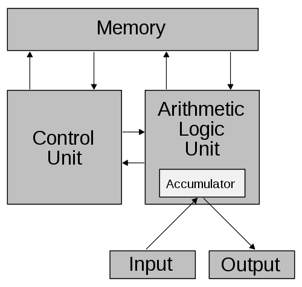
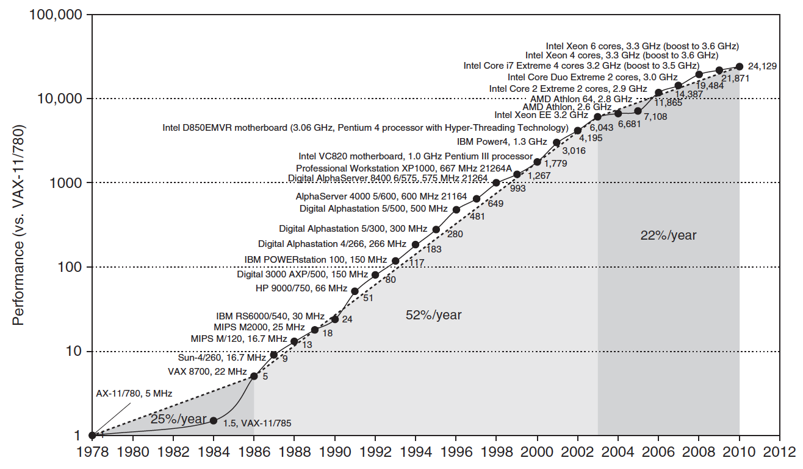
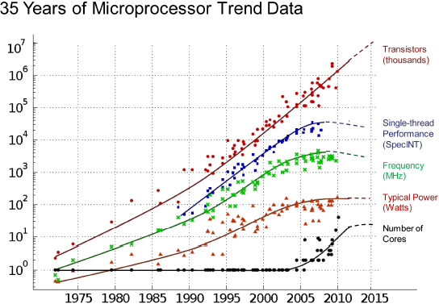
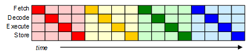
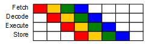
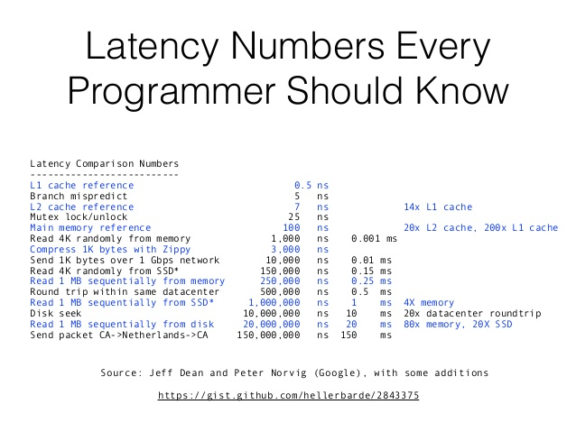

// build_options: 
Computer architecture
=====================
Arnauld Van Muysewinkel <avm@pendragon.be>
v0.1, 23-Nov-2016: Draft version
:backend: slidy
:data-uri:
ifdef::env-build[:icons: font]
:extension: adoc
//extension may be overriden by compile.sh
ifeval::["{extension}"!="pdf"]
:doctitle: Good Programming Practices for Performance - {doctitle}
:lastpage: lastpage.adoc.include
endif::[]
:copyright: Creative-Commons-Zero (Arnauld Van Muysewinkel)

Content
-------

* <<_references,References>>
* <<von_neumann,Von Neuman architecture>>
* <<moores_law,Moore's Law?>>
* <<_3_phases,3 phases of CPU improvement>>
* <<_topics,Topics>>

_(link:0.1-training_plan.{extension}#_preamble[back to plan])_

References
----------

* A Crash Course in Modern Hardware. Dr Cliff Click. Devoxx. Nov-2016. Video.
  https://www.youtube.com/watch?v=OFgxAFdxYAQ
* Not Your Father's Von Neumann Machine: A Crash Course in Modern Hardware. Dr Cliff Click. JavaOne. 2009. Slides deck.
  http://www.azulsystems.com/events/javaone_2009/session/2009_J1_HardwareCrashCourse.pdf

[[von_neumann]]
Von Neuman architecture
-----------------------

[cols="<a,^",frame="none"]
|=====
|
* *Memory* shared between _data_ and _code_
* *CU* with _instruction register_ and _program counter_
* *ALU* with _process registers_
* *CPU* = CU + ALU
| 
|=====

Von Neuman architecture
-----------------------

This is history now:

* does not correspond to reality anymore
* still a good abstraction
* was good for sequential execution

But modern day computers had to become much more complex,
and much less sequential.

[[moores_law]]
Moore's Law?
------------

Moore's Law?
------------

[[_3_phases]]
The 3 phases of CPU improvement
-------------------------------

The previous diagrams show 3 phases in the race for performance:

* CISC
* frequency scaling
* multicore

First era: CISC
---------------

* memories are small
* must avoid swapping
* code must be compact
* each instruction is able to do complex tasks

Performance is gained by making instructions more complex, yet "CISC"

Second era: Frequency scaling
-----------------------------

Performance is gained by:

* technology improvement
** higher frequencies
** more transistors by in^2^
* more complex architectures,
  based on prediction algorithms
** ILP (Instruction Level Parallelism)
** Multiple cache levels
** Hyper-threading

Prediction algorithms require simpler instructions,
which is made possible by bigger memories.

Hence the transition towards "RISC" CPU architecture.

ILP: Pipelining
---------------

* a CPU instruction takes more than 1 clock tick (_clk_) to execute
* a typical RISC instruction requires 4 to 10 sequential steps, e.g.: +
+fetch+ > +decode+ > +execute+ > +store+

* => it's possible to start the instruction +n+1+ once the instruction +n+ is in the second step

ILP: Pipelining
---------------

* the more instructions running in //, the higher the _throughput_
* but the _latency_ (total duration of an instruction) does not increase

[NOTE]
.Examples
=====
The first Pentium had 2 pipelines of 5 or 6 stages. +
The Pentium 4 ("NetBurst") has a pipeline with 20 stages. +
The Xeon family of CPUs have a 31 stages pipeline.
=====

ILP: Branch prediction
----------------------

ILP: Prefetching
----------------

Cache levels
------------

Hyper-threading
---------------

The wall
--------

Third era: multi-cores
----------------------

Topics
------

* typical latencies

 https://gist.github.com/hellerbarde/2843375

include::{lastpage}[]
