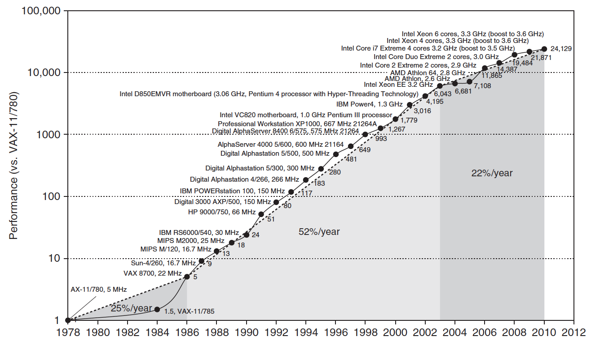
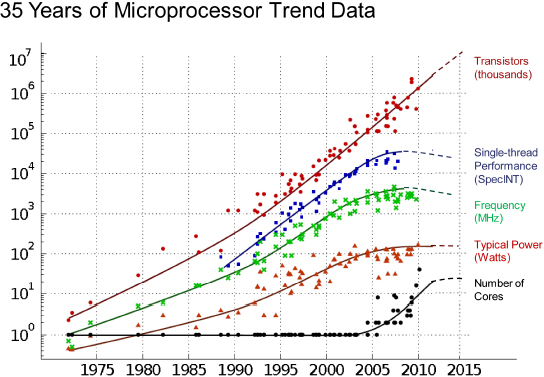
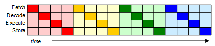
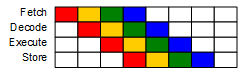
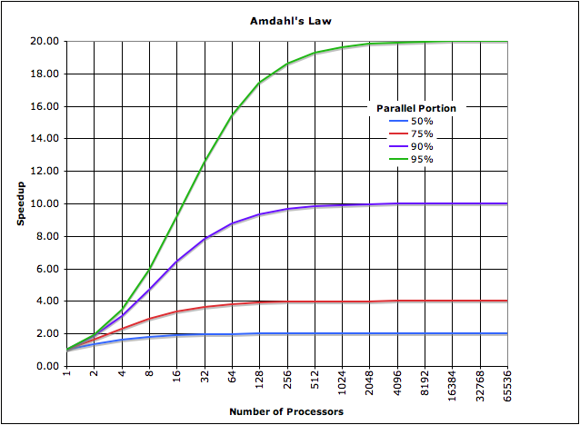
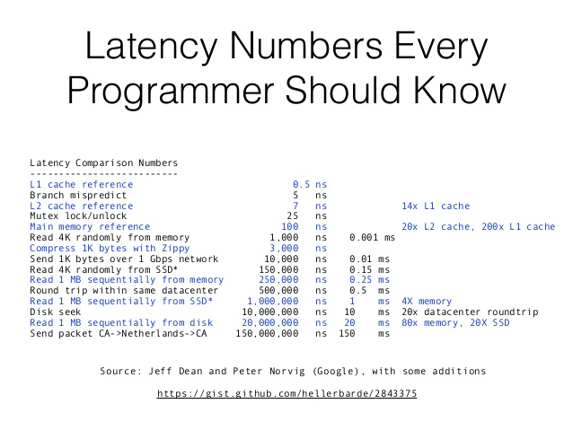

// build_options: 
Computer architecture
=====================
Arnauld Van Muysewinkel <avm@pendragon.be>
v0.1, 27-Nov-2016: Draft version
:backend: slidy
:data-uri:
ifdef::env-build[:icons: font]
:extension: adoc
//extension may be overriden by compile.sh
ifeval::["{extension}"!="pdf"]
:doctitle: Good Programming Practices for Performance - {doctitle}
:lastpage: lastpage.adoc.include
endif::[]
:copyright: Creative-Commons-Zero (Arnauld Van Muysewinkel)
:tld: ~
:ne: &#8800;

Content
-------

* <<_references,References>>
* <<von_neumann,Von Neuman architecture>>
* <<moores_law,Moore's Law?>>
* <<_3_phases,3 phases of CPU improvement>>
** <<first_era,First era: CISC>>
** <<second_era,Second era: Frequency scaling>>
*** Instructions pipelining, Out-of-order execution, Branch prediction, Multi-threading, Cache levels
** <<third_era,Third era: multi-cores>>
*** Amdahl's law
* <<_typical_latencies,Typical latencies>>

_(link:0.1-training_plan.{extension}#_preamble_infrastructure[back to plan])_

References
----------

* A Crash Course in Modern Hardware. Dr Cliff Click. Devoxx. Nov-2016. Video.
  https://www.youtube.com/watch?v=OFgxAFdxYAQ
* Not Your Father's Von Neumann Machine: A Crash Course in Modern Hardware. Dr Cliff Click. JavaOne. 2009. Slides deck.
  http://www.azulsystems.com/events/javaone_2009/session/2009_J1_HardwareCrashCourse.pdf

[[von_neumann]]
Von Neuman architecture
-----------------------

[cols="<a,^",frame="none"]
|=====
|
* *Memory* shared between _data_ and _code_
* *CU* with _instruction register_ and _program counter_
* *ALU* with _process registers_
* *CPU* = CU + ALU
| image:images/Von_Neumann_architecture.svg-500px.gif[width="350"]
|=====

Von Neuman architecture
-----------------------

This is history now:

* does not correspond to reality anymore
* still a good abstraction
* was good for sequential execution

But modern day computers had to become much more complex,
and much less sequential.

[[moores_law]]
Moore's Law?
------------

Moore's Law?
------------

[[_3_phases]]
The 3 phases of CPU improvement
-------------------------------

The previous diagrams show 3 phases in the race for performance:

* CISC
* frequency scaling
* multicore

[[first_era]]
First era: CISC
---------------

{tilde}1960->{tilde}1985

* memories are small
* must avoid swapping
* code must be compact
* each instruction is able to do complex tasks

Performance is gained by making instructions more complex, yet "CISC"

[[second_era]]
Second era: Frequency scaling
-----------------------------

{tilde}1985->{tilde}2005

Performance is gained by:

* technology improvement
** higher frequencies
** more transistors by in^2^
* more complex architectures,
  based on prediction algorithms
** ILP (Instruction Level Parallelism)
** Out-of-order execution, Branch prediction
** TLP (Thread Level Parallelism)
** Multiple cache levels

Prediction algorithms require simpler instructions,
which is made possible by bigger memories.

Hence the transition towards "RISC" CPU architecture.

ILP: Instructions pipelining
----------------------------

(a.k.a. Superscalar processors)

* a CPU instruction takes more than 1 clock tick (_clk_) to execute
* a typical RISC instruction requires 4 to 10 sequential steps, e.g.: +
+fetch+ > +decode+ > +execute+ > +store+

* => it's possible to start the instruction +n+1+ once the instruction +n+ is in the second step

ILP: Instructions pipelining
----------------------------

* the more instructions running in //, the higher the _throughput_
* but the _latency_ (total duration of an instruction) does not decrease

[NOTE]
.Examples
=====
The first Pentium had 2 pipelines of 5 or 6 stages. +
The Pentium 4 ("NetBurst") has a pipeline with 20 stages. +
The Xeon family of CPUs have a 31 stages pipeline.
=====

Out-of-order execution
----------------------

* reading data from cache is slower than 1 clk
* rather than waiting for the data, the CPU starts executing next instructions
* CPU could even completely change the order of execution
(several instructions being _prefetched_ in the instructions queue)

Branch prediction
-----------------

* if the data required for deciding a conditional branch is not yet arrived,
the CPU _predicts_ the branch, and continues the execution
(even though the actual data is not yet known)
* if the branch was mis-predicted, it must "clean the mess"
(and lose time)
* prediction is good 95% of the time

TLP: Multi-threading
--------------------

* requires several sets of register
* we spare the time required for the context-switching
** -> TMT: Temporal multi-threading
** only one thread at a time

* we may also use the slots lost waiting for the memory
** -> SMT: Simultaneous multi-threading, a.k.a. hyper-threading or HT (Intel)
** several instructions from different threads are mixed at the same time in the pipeline

TLP: Multi-threading
--------------------

TLP: Multi-threading
--------------------

* gain limited by the contention on shared resources (caches, memory bus)
* depends a lot on the application:
** +none+ for pure calculation (no idle slots)
** theoretically up to +x 2+ for pure memory access (for 2 threads HT) (practically {tld}30%)

Cache levels
------------

* memory speed does not increase as fast as CPU

* now, fetching from memory can take 100s of +clk+
* -> multilevel caches

Cache levels
------------

* L1, L2 caches per core
* L3 cache shared between all cores

Cache levels
------------

* Memory: cheap and slow DRAM
* Caches: expensive and fast SRAM
* caches are smaller => closer (! speed of light)
** 3 cm = 0.333ns = 1 clk (@ 3GHz)
** actually:
+
[cols="4*^",width="70%"]
|=====
| Registers |      L1     |      L2      |      RAM
| <1 clk    | {tld}3 clks | {tld}15 clks | {tld}200 clks
|=====

CAUTION: Even if cache misses are rare (<5%),
the cost is so high that they dominate the performance

Cache levels
------------

* data transferred at once by small blocks called "lines"
* 1 cache line is typically 64 bytes (Intel) +
  (= 32 shorts = 16 ints = 8 longs = 8 to 16 references)
* => best to address consecutive data (already fetched in the cache)

Moreover:

* same piece of data may be present in 2 separate L1 caches
(possibly with {ne} values!)
* => need to synchronize (takes time!)

http://www.aristeia.com/TalkNotes/ACCU2011_CPUCaches.pdf

The walls
---------

Power:: can't melt the CPU!
ILP:: branch prediction has its limits
memory:: becomes the dominant of programs performance
speed of light:: 1 clk = 3 cm @10Ghz

[[third_era]]
Third era: multi-cores
----------------------

{tilde}2005->...

* more cores, but not faster
* New challenges...
** cache invalidation
** OS support
** applications rewriting
** ...
* we must adapt our way of programming
* New limit: Amdahl's law

CAUTION: Data access patterns are now the key for good performance.

Amdahl's law
------------

Typical latencies
-----------------

https://gist.github.com/hellerbarde/2843375

Typical latencies
-----------------

Typical latencies
-----------------

https://people.eecs.berkeley.edu/~rcs/research/interactive_latency.html +
or https://github.com/colin-scott/interactive_latencies

include::{lastpage}[]
