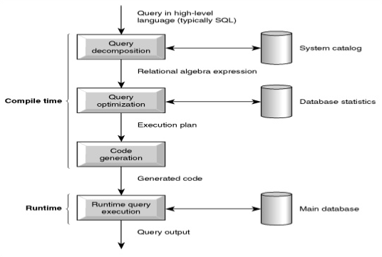

// build_options: 
Oracle Database
===============
Arnauld Van Muysewinkel <avm@pendragon.be>
v0.1, 25-Nov-2016: Draft version
:backend: slidy
:data-uri:
ifdef::env-build[:icons: font]
:extension: adoc
//extension may be overriden by compile.sh
ifeval::["{extension}"!="pdf"]
:doctitle: Good Programming Practices for Performance - {doctitle}
:lastpage: lastpage.adoc.include
endif::[]
:copyright: Creative-Commons-Zero (Arnauld Van Muysewinkel)

Content
-------

* <<_sql_statement_processing,SQL statement processing>>
* <<_sql_optimizers,SQL optimizers>>
* <<_execution_plan,Execution plan>>

_(link:0.1-training_plan.{extension}#_preamble_middleware[back to plan])_

SQL statement processing
------------------------

SQL statement processing
------------------------

image::images/cncpt250.gif[width="350"]

SQL optimizers
--------------

* CBO (Cost-Base Optimizer) is better than RBO (Rule-Based Optimizer)
* but CBO requires statistics -> rebuild periodically

Modes:

* ALL_ROWS: best throughput
* FIRST_ROWS: fast response

Execution plan
--------------

Based on WHERE clause.

Either 1 step:

* FULL TABLE SCAN -> reads the whole table

or 2 steps:

* INDEX UNIQUE SCAN -> retrieve a single rowid from index
* INDEX RANGE SCAN -> retrieve one or several rowids from index
* INDEX FAST FULL SCAN -> if the CBO estimates that a large portion of the index will be returned

+ TABLE ACCESS BY INDEX ROWID

include::{lastpage}[]
