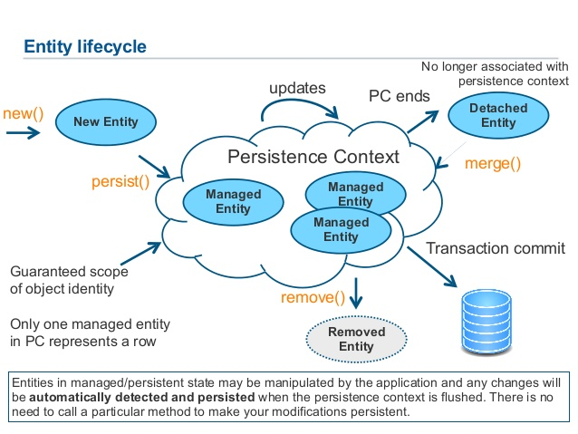

// build_options: 
Good Programming Practices for Performance - Persistence, Database
==================================================================
Arnauld Van Muysewinkel <avm@pendragon.be>
v0.1, 23-Nov-2016: Draft version
:backend: slidy
:data-uri:
ifdef::env-build[:icons: font]
:extension: adoc
//extension may be overriden by compile.sh
:copyright: Creative-Commons-Zero (Arnauld Van Muysewinkel)

Content
-------

* <<_transactions,Transactions>>
* <<_jpa,JPA>>
* <<_sql,SQL>>
* <<_other_advices,Other advices>>

_(link:0.1-training_plan.{extension}#_best_practices[back to plan])_

Transactions
------------

NOTE: Choose carefully the transaction type

Transaction attribute type can have one of the following values:

* +Required+
* +RequiresNew+
* +Mandatory+
* +NotSupported+
* +Supports+
* +Never+

See http://docs.oracle.com/javaee/6/api/javax/ejb/TransactionAttributeType.html[Javadoc]

JPA
---

NOTE: Make sure you manually disabled all (shared) caching (L2 cache)

in persistence.xml (! default for eclipselink is to enable the shared cache)

NOTE: Carefully tune LAZY vs. EAGER

FYI: defaults:

* for {One,Many}ToOne is *EAGER*,
* for {One,Many}ToMany is *LAZY*

_Example: in Publiato session size 500kB -> 250 kB because of PDF attachment uselessly retrieved by JPA_

JPA
---

NOTE: Fetch when necessary, if necessary

NOTE: Use (native) queries when retrieving only tiny pieces of data

pass:[...] to avoid loading whole object tree when only

_Example: in ePV response time 20s -> 1s because a big object tree was loaded in LAZY mode, just to retrieve one integer_

NOTE: Make sure your data model does not imply O(n) or O(n2) performance

JPA
---

http://www.slideshare.net/ecosio/introduction-to-jpa-and-hibernate-using

JPA
---

NOTE: merge != persist != save

NOTE: avoid: flush, refresh

NOTE: bidirectional relationships must be maintained manually

NOTE: use fetch joins to avoid additional queries

NOTE: carefully choose the correct join type

SQL
---

NOTE: Use bind variables

* (do *not* inject parameters directly in your SQL query)
* avoids "hard parsing": execution plan is retrieved from "shared pool"

NOTE: Generally speaking, avoid creating your requests dynamicaly

("query-builder-like" applications are evil)

SQL
---

image::images/cncpt250.gif[]

Other advices
-------------

* avoid useless fetches from DB (beware of ORM)
* pagination
* optimize your JPA model, optimize your SQL calls
 http://howtodoinjava.com/core-java/jdbc/best-practices-to-improve-jdbc-performance/
 http://www.javaperformancetuning.com/tips/jdbc_prepared.shtml
 http://www.javaperformancetuning.com/tips/rawtips.shtml >> http://www.as400.ibm.com/developer/java/topics/jdbctips.html
* Use +PreparedStatement+, parameters *must* be injected through bind variables
* use batch mode when applicable
* avoid multiple joins (highly non-linear!)
* Use optimistic transactions
* no autocommit, but keep transactions short (group all DB requests is possible)

:numbered!:
That's all folks!
-----------------

[cols="^",grid="none",frame="none"]
|=====
|image:images/thats-all-folks.png[link="#(1)"]
|=====
